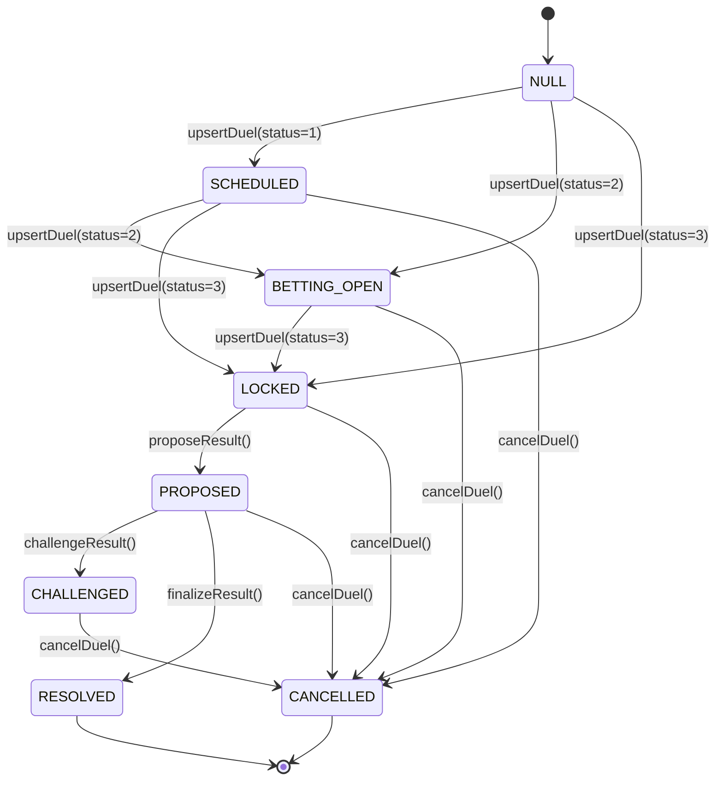

# Oracle Finality Model

## Overview

The `DuelOutcomeOracle` manages the lifecycle of competitive duel outcomes across EVM chains. This document defines the finality semantics — how a duel reaches terminal state, what guarantees exist at each stage, and how the system prevents premature settlement.

## State Machine

## Terminal States

| State | Code | Finality | Winner Set? | Reversible? |
|---|---|---|---|---|
| **RESOLVED** | 6 | ✅ Terminal | Yes | No |
| **CANCELLED** | 7 | ✅ Terminal | No (NONE) | No |

**Invariant**: Once a duel reaches RESOLVED or CANCELLED, no function can mutate its state. This is enforced by `_requireSettleable()` which reverts on both terminal states.

## Dispute Window

- **Type**: Immutable (`uint64 immutable disputeWindowSeconds`)
- **Set at**: Constructor only — no setter exists
- **Enforcement**: `finalizeResult()` requires `block.timestamp >= proposedAt + disputeWindowSeconds`
- **Default**: 3600 seconds (1 hour)
- **Validation**: Constructor rejects `disputeWindowSeconds == 0`

### Timing Guarantees

| Action | Requirement |
|---|---|
| `proposeResult()` | Duel must be LOCKED, betting window must be closed |
| `challengeResult()` | Must be within dispute window (`block.timestamp < proposedAt + disputeWindowSeconds`) |
| `finalizeResult()` | Must be after dispute window (`block.timestamp >= proposedAt + disputeWindowSeconds`) |

## Settlement Ordering

1. **Reporter** proposes a result → status = PROPOSED
2. **Dispute window** opens (starts at `proposedAt`)
3. During window: **Challenger** may challenge → status = CHALLENGED
4. After window: **Finalizer** may finalize → status = RESOLVED
5. At any non-terminal stage: **Pauser** may cancel → status = CANCELLED

**No settlement occurs before terminal finalization.** The `winner` field on the `DuelState` struct is only populated during `finalizeResult()`. In all non-terminal states, `winner == Side.NONE (0)`.

## Roles

| Role | Granted To | Can Do |
|---|---|---|
| `DEFAULT_ADMIN_ROLE` | Admin/Timelock | Manage all other roles |
| `REPORTER_ROLE` | Backend signer | `upsertDuel`, `proposeResult` |
| `FINALIZER_ROLE` | Backend signer | `finalizeResult` |
| `CHALLENGER_ROLE` | Backend/Multisig | `challengeResult` |
| `PAUSER_ROLE` | Emergency council | `cancelDuel`, `setOraclePaused` |

## Cancellation Stance

`cancelDuel()` is an **emergency-only** function restricted to `PAUSER_ROLE`. It:
- Sets status to CANCELLED
- Clears `activeProposalId`
- Can be called from any non-terminal state (SCHEDULED → CHALLENGED)
- Is the only admin-side mechanism for halting a duel

**Important**: Cancellation does not require a reason parameter. The `metadataUri` field can be used to document the reason off-chain.

## Cross-Chain Parity Matrix

### State Machine Parity

| State | EVM Code | Solana Variant | Transitions Match? |
|---|---|---|---|
| NULL | 0 | (account doesn't exist) | ✅ Equivalent |
| SCHEDULED | 1 | `Scheduled` | ✅ |
| BETTING_OPEN | 2 | `BettingOpen` | ✅ |
| LOCKED | 3 | `Locked` | ✅ |
| PROPOSED | 4 | `Proposed` | ✅ |
| CHALLENGED | 5 | `Challenged` | ✅ |
| RESOLVED | 6 | `Resolved` | ✅ |
| CANCELLED | 7 | `Cancelled` | ✅ |

### Feature Parity

| Feature | EVM (`DuelOutcomeOracle.sol`) | Solana (`fight_oracle/lib.rs`) | Parity | Notes |
|---|---|---|---|---|
| **Dispute window type** | `immutable uint64` (constructor) | `i64` in `OracleConfig` (mutable) | ⚠️ Divergence | EVM stricter — Solana allows admin to change post-deploy via `update_oracle_config` |
| **Dispute window validation** | `> 0` in constructor | `> 0` in both `initialize_oracle` and `update_oracle_config` | ✅ | Both enforce positive |
| **Initialization roles** | Constructor takes 5 role addresses | `initialize_oracle` takes 4 role addresses (after PM16 fix) | ✅ | EVM has dedicated PAUSER; Solana cancels via authority |
| **Bootstrap fallback** | None (never had one) | Removed in PM16 | ✅ | Solana no longer defaults roles to authority |
| **Terminal state guard** | `DuelAlreadyResolved` / custom errors | `DuelAlreadyFinalized` / `DuelAlreadyCancelled` | ✅ | Same logic, different error names |
| **State regression guard** | `InvalidTransition` revert | `InvalidLifecycleTransition` | ✅ | Both use rank comparison |
| **Winner set timing** | Only in `finalizeResult()` | Only in `finalize_result()` | ✅ | Winner = NONE until terminal |
| **Proposal ID** | `keccak256(duelKey, resultHash, replayHash)` | `keccak256(duelKey, resultHash, replayHash)` | ✅ | Same hash scheme |
| **Challenge window** | `block.timestamp < proposedAt + window` | `clock.unix_timestamp < proposed_at + window` | ✅ | |
| **Finalization window** | `block.timestamp >= proposedAt + window` | `clock.unix_timestamp >= proposed_at + window` | ✅ | |
| **Cancellation authority** | `PAUSER_ROLE` only | `authority` only | ⚠️ Divergence | EVM uses dedicated PAUSER role; Solana uses general authority |
| **Cancel clears proposal** | Yes (`activeProposalId = 0`) | Yes (`active_proposal = [0; 32]`) | ✅ | |
| **Cancel from any state** | SCHEDULED→CHALLENGED | SCHEDULED→CHALLENGED | ✅ | Both block cancel on terminal |
| **Pause mechanism** | `setOraclePaused(bool)` — global pause | None | ⚠️ Missing | Solana has no global pause flag |
| **Role management** | OZ AccessControl (multi-holder) | Single pubkey per role | ⚠️ Divergence | EVM allows multiple reporters; Solana has exactly one |
| **Upgrade authority gate** | N/A (immutable contract) | `program_data.upgrade_authority` check | ✅ | Different security models |
| **Pending fields** | Stored in separate mapping | Stored inline on `DuelState` | ✅ | Implementation difference, same semantics |

### Known Divergences (Documented, Not Blocking)

1. **Dispute window mutability**: EVM `immutable` vs Solana admin-mutable. EVM is stricter. Both enforce `> 0`. Acceptable because Solana admin key is the upgrade authority.

2. **Cancellation authority**: EVM uses dedicated `PAUSER_ROLE` while Solana uses the general `authority`. This means the Solana authority can both manage roles AND cancel duels. Risk is acceptable in the current permissioned model but should be revisited if moving to multisig governance.

3. **Global pause**: EVM has `setOraclePaused()` which blocks all writes. Solana has no equivalent. An operational workaround exists (revoke reporter key), but it's not as clean.

4. **Multi-holder roles**: EVM `AccessControl` allows multiple addresses to hold `REPORTER_ROLE`. Solana stores a single `reporter` pubkey. This limits Solana to one reporter backend.

> [!IMPORTANT]
> None of these divergences create a security vulnerability — they reflect different security models (role-based vs authority-based). Both chains enforce the same invariant: **no settlement occurs before terminal finalization, and terminal states are irreversible.**
