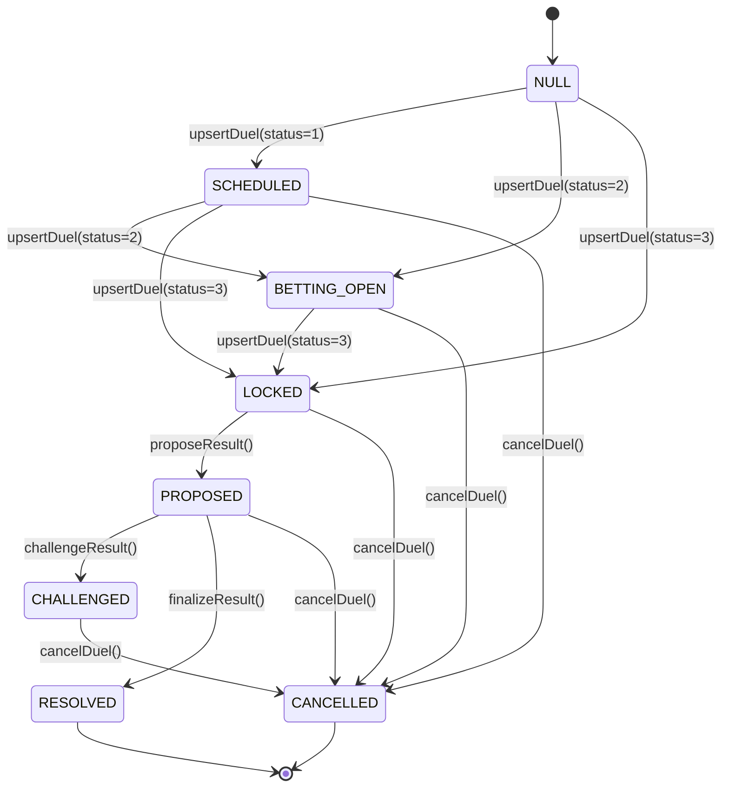

# Oracle Finality Model

## Overview

The `DuelOutcomeOracle` manages the lifecycle of competitive duel outcomes across EVM chains. This document defines the finality semantics — how a duel reaches terminal state, what guarantees exist at each stage, and how the system prevents premature settlement.

## State Machine

## Terminal States

| State | Code | Finality | Winner Set? | Reversible? |
|---|---|---|---|---|
| **RESOLVED** | 6 | ✅ Terminal | Yes | No |
| **CANCELLED** | 7 | ✅ Terminal | No (NONE) | No |

**Invariant**: Once a duel reaches RESOLVED or CANCELLED, no function can mutate its state. This is enforced by `_requireSettleable()` which reverts on both terminal states.

## Dispute Window

- **Type**: Immutable (`uint64 immutable disputeWindowSeconds`)
- **Set at**: Constructor only — no setter exists
- **Enforcement**: `finalizeResult()` requires `block.timestamp >= proposedAt + disputeWindowSeconds`
- **Default**: 3600 seconds (1 hour)
- **Validation**: Constructor rejects `disputeWindowSeconds == 0`

### Timing Guarantees

| Action | Requirement |
|---|---|
| `proposeResult()` | Duel must be LOCKED, betting window must be closed |
| `challengeResult()` | Must be within dispute window (`block.timestamp < proposedAt + disputeWindowSeconds`) |
| `finalizeResult()` | Must be after dispute window (`block.timestamp >= proposedAt + disputeWindowSeconds`) |

## Settlement Ordering

1. **Reporter** proposes a result → status = PROPOSED
2. **Dispute window** opens (starts at `proposedAt`)
3. During window: **Challenger** may challenge → status = CHALLENGED
4. After window: **Finalizer** may finalize → status = RESOLVED
5. At any non-terminal stage: **Pauser** may cancel → status = CANCELLED

**No settlement occurs before terminal finalization.** The `winner` field on the `DuelState` struct is only populated during `finalizeResult()`. In all non-terminal states, `winner == Side.NONE (0)`.

## Roles

| Role | Granted To | Can Do |
|---|---|---|
| `DEFAULT_ADMIN_ROLE` | Admin/Timelock | Manage all other roles |
| `REPORTER_ROLE` | Backend signer | `upsertDuel`, `proposeResult` |
| `FINALIZER_ROLE` | Backend signer | `finalizeResult` |
| `CHALLENGER_ROLE` | Backend/Multisig | `challengeResult` |
| `PAUSER_ROLE` | Emergency council | `cancelDuel`, `setOraclePaused` |

## Cancellation Stance

`cancelDuel()` is an **emergency-only** function restricted to `PAUSER_ROLE`. It:
- Sets status to CANCELLED
- Clears `activeProposalId`
- Can be called from any non-terminal state (SCHEDULED → CHALLENGED)
- Is the only admin-side mechanism for halting a duel

**Important**: Cancellation does not require a reason parameter. The `metadataUri` field can be used to document the reason off-chain.

## Cross-Chain Parity (EVM vs Solana)

| Feature | EVM | Solana | Parity |
|---|---|---|---|
| Dispute window | Immutable constructor arg | Config, admin-mutable | ⚠️ Solana more flexible |
| Cancellation | PAUSER_ROLE | Authority | ✅ Equivalent |
| State machine | 8 states (NULL→CANCELLED) | Equivalent enum | ✅ |
| Winner set timing | Only at finalize | Only at finalize | ✅ |
| Role management | AccessControl (OZ) | Authority CPI | ✅ Equivalent |

> [!IMPORTANT]
> The Solana program allows updating `dispute_window_seconds` after initialization (admin-mutable), while the EVM contract makes it immutable. This is a documented divergence — the EVM approach is stricter. Both enforce `> 0`.
