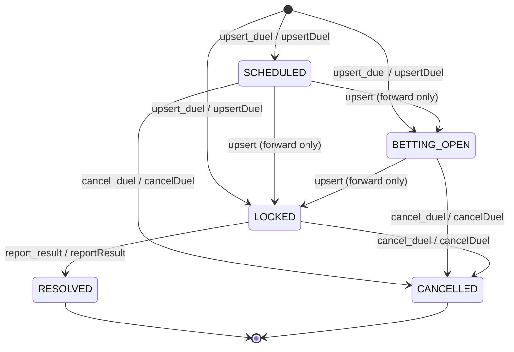
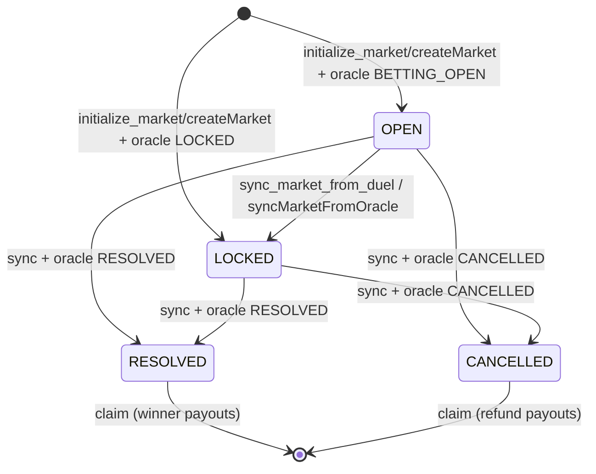
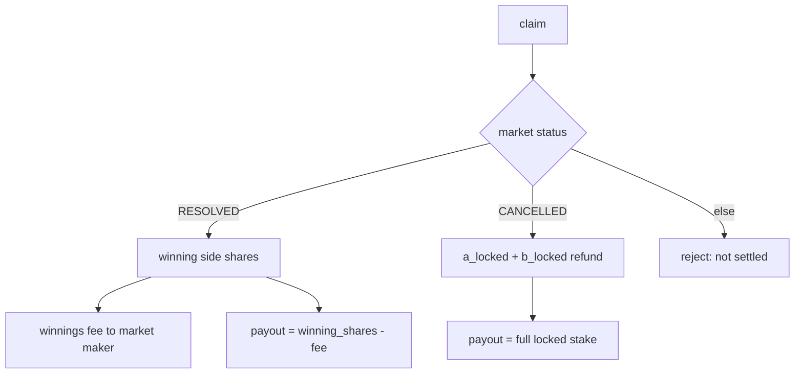

# Oracle + Market State Transition Diagrams

## Oracle Duel Lifecycle

```mermaid
stateDiagram-v2
    [*] --> SCHEDULED: upsert_duel / upsertDuel
    [*] --> BETTING_OPEN: upsert_duel / upsertDuel
    [*] --> LOCKED: upsert_duel / upsertDuel

    SCHEDULED --> BETTING_OPEN: upsert (forward only)
    SCHEDULED --> LOCKED: upsert (forward only)
    SCHEDULED --> CANCELLED: cancel_duel / cancelDuel

    BETTING_OPEN --> LOCKED: upsert (forward only)
    BETTING_OPEN --> CANCELLED: cancel_duel / cancelDuel

    LOCKED --> RESOLVED: report_result / reportResult
    LOCKED --> CANCELLED: cancel_duel / cancelDuel

    RESOLVED --> [*]
    CANCELLED --> [*]
```

## Market Lifecycle (synced from oracle)

```mermaid
stateDiagram-v2
    [*] --> OPEN: initialize_market/createMarket + oracle BETTING_OPEN
    [*] --> LOCKED: initialize_market/createMarket + oracle LOCKED

    OPEN --> LOCKED: sync_market_from_duel / syncMarketFromOracle
    OPEN --> RESOLVED: sync + oracle RESOLVED
    OPEN --> CANCELLED: sync + oracle CANCELLED

    LOCKED --> RESOLVED: sync + oracle RESOLVED
    LOCKED --> CANCELLED: sync + oracle CANCELLED

    RESOLVED --> [*]: claim (winner payouts)
    CANCELLED --> [*]: claim (refund payouts)
```

## Settlement Branching

```mermaid
flowchart TD
    A[claim] --> B{market status}
    B -->|RESOLVED| C[winning side shares]
    B -->|CANCELLED| D[a_locked + b_locked refund]
    B -->|else| E[reject: not settled]
    C --> F[winnings fee to market maker]
    C --> G[payout = winning_shares - fee]
    D --> H[payout = full locked stake]
```
